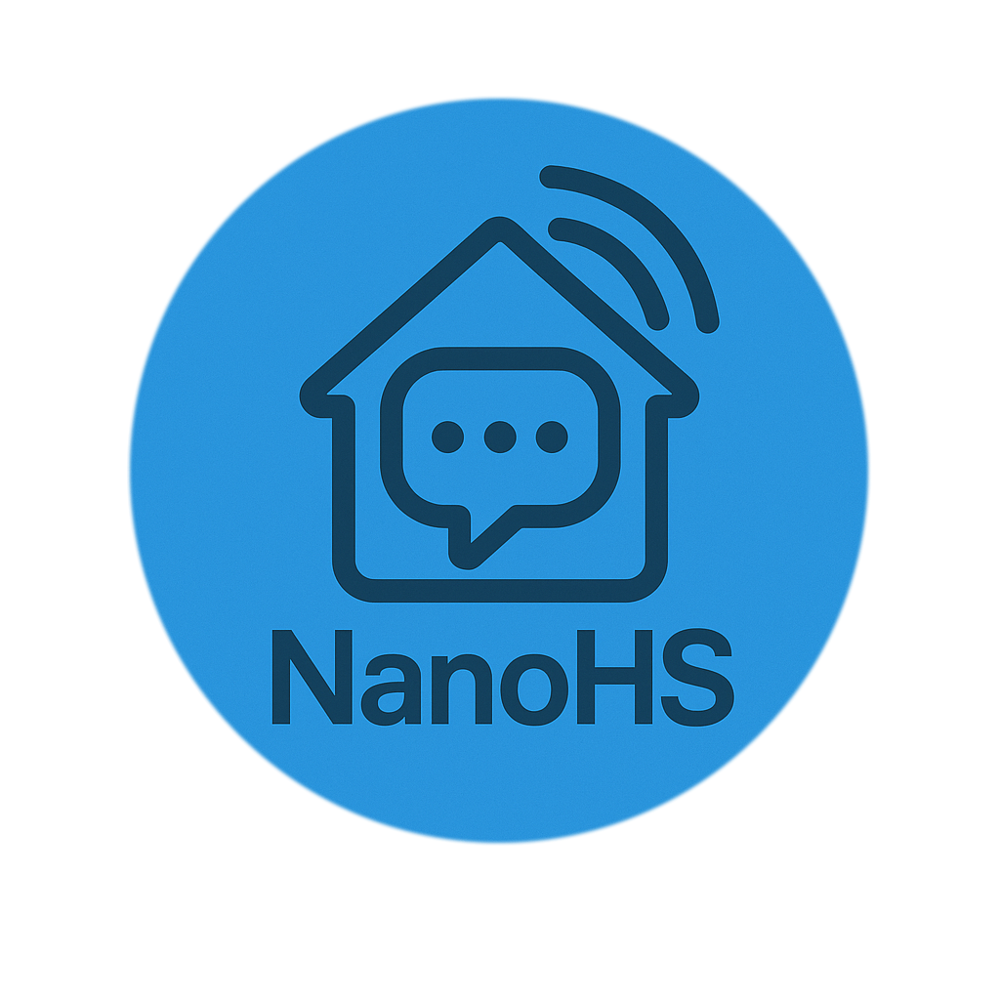

<h1 align="center">

  
  

NanoHomeScript
</h1>

NanoHomeScript is a lightweight programming language designed specifically for **home automation** and **phone notification workflows**.  
Its syntax is clean, human-readable, and tailored for writing automation scripts that connect smart devices, sensors, and custom alerts.

## ✨ Purpose
While many automation platforms rely on JSON, YAML, or complex scripting APIs, nanoHS offers:
- **Readable, beginner-friendly syntax** — write automation rules without getting lost in brackets and indentation.
- **Optional strong typing** — get the safety of strict types when you want them, or let the language handle casting automatically.
- **Native event-driven structure** — respond instantly to triggers from your home devices or apps.
- **Built-in scheduling** — easily set up recurring actions or delayed executions.
- **Seamless integration** — connect directly to common home automation protocols and APIs without extra glue code.

## 📦 Current Capabilities
The parser currently supports:
- **Variable declarations** (`var:int lightLevel;`)
- **Automatic initialization** (`var message = "Lights on!";`)
- **Inline arrays** (`var rooms = {"kitchen", "bedroom", "garage"};`)
- **Dinamic multy types arrays** (`var multiArr = {"A string!", 1, {1,2,3,4};`)
- **math and logic** (`+`, `-`, `*`, `/`, `%`, `<=`, `and`, `or`, ...)
- **While and ifs**
- **Function definitions with typed return values**
- **Recognition of custom return types**
- **Syntax validation** for common mistakes
- **Struct support**

Wanna see a quick code example? Read Test.nhs or Grammar.nhs in Tests folder!

## 🔮 Roadmap
Planned features include:
- **Additional control flow**: `for`, `foreach`
- **Device interaction API** (turn lights on/off, adjust thermostat, send notifications)
- **Notification commands** for push alerts, SMS, or voice assistants
- **Scheduled triggers** and timers
- **Event-driven automation** (e.g. on motion detected, on door opened)
- **Integration with popular home assistants** (Home Assistant, OpenHAB, Node-RED, Alexa, GoogleHome, Chatgpt)

📌 Notes
This language is under active development — syntax and features may change.

The initial focus is home automation + notifications, but the design is flexible for other IoT use cases.

🤝 Contributing
Want to help make NanoHomeScript the ultimate smart home scripting language?

* Fork the repository

* Add your automation ideas

* Submit a pull request

* Contact me: dacco.andrea.05@gmail.com
